# Aizen ekranları ve işlevleri

Windows sürümü · 22 ekran görüntüsü. Kurulum adımları: [KURULUM.md](../KURULUM.md).

> Görüntüler **örnek veriyle** doldurulmuş geçici bir kopyadan alındı: uygulama adları,
> süreler, siteler, aramalar, cihazlar, bilgisayar ve kullanıcı adı uydurmadır. Mac
> sürümünün görüntüsü yok (aşağıda sekmeleri yazılı).

**İçindekiler:** [Kontrol paneli](#1-kontrol-paneli) · [Ayarlar](#2-ayarlar-penceresi) ·
[Yardım](#3-yardım-uygulama-içi-wiki) · [Çalışma raporu](#4-çalışma-raporu) ·
[Hatırlatma uyarısı](#5-hatırlatma-uyarısı) · [Periyot engeli](#6-çalışma-periyodu-engeli) ·
[Kurulum sihirbazı](#7-kurulum-sihirbazı) · [Merkez paneli](#8-merkez-paneli) ·
[Görüntüsü olmayanlar](#9-görüntüsü-olmayanlar)

`Aizen-Ekranlar.html` aynı içeriğin tek dosyalık yerel kopyasıdır; depoya girmez.

---

## 1. Kontrol paneli

Masaüstündeki **Aizen** kısayolu açar. 10 saniyede bir kendini yeniler.

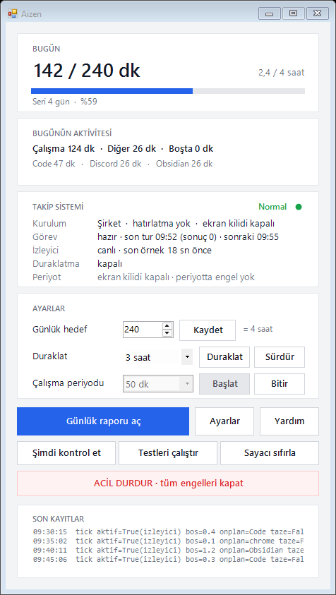

*Solda bireysel kurulum; sağda şirket kurulumu: erteleme hakkı yok, periyot başlatılamıyor.*

**Bugün**
- Bugünkü çalışma süresi / günlük hedef, saat karşılığı ve ilerleme çubuğu.
- Seri (hedefin art arda tutulduğu gün), yüzde ve kalan erteleme hakkı. Erteleme hakkı yalnızca hatırlatmalar açıkken görünür.
- Merkeze bağlı birden fazla bilgisayar varsa toplamda bu bilgisayarın payı da yazar.

**Bugünün aktivitesi**
- Çalışma, diğer ve boşta dakikaları; en çok kullanılan üç uygulama. Dakikada bir güncellenir.

**Takip sistemi**
- **Normal / Sorun var** göstergesi.
- **Kurulum:** tür, hatırlatmaların ve ekran kilidinin durumu.
- **Görev:** 5 dakikalık zamanlanmış görevin durumu, son ve sonraki çalışma saati.
- **İzleyici:** arka plan ölçümünün son örneği kaç saniye önce yazdığı.
- **Duraklatma** ve **Periyot** durumu; acil durdurma açıksa kırmızı uyarı.

**Ayarlar kartı**
- **Günlük hedef** (15–720 dk) + Kaydet.
- **Duraklat:** 1 / 3 / 6 saat, Bugünlük, Süresiz. Duraklatmada sayaç ilerlemez, aktivite yazılmaz, uyarı çıkmaz. **Sürdür** hemen geri açar.
- **Çalışma periyodu:** 25 / 50 / 90 / 120 dk. Periyotta izinsiz bir uygulama açılınca engel ekranı çıkar. Ekran kilidi kapalıysa Başlat pasiftir; **Bitir** periyodu sonlandırır.

**Düğmeler**
- **Günlük raporu aç:** çalışma raporu penceresi.
- **Ayarlar** ve **Yardım:** aşağıdaki pencereler.
- **Şimdi kontrol et:** 5 dakikalık turu beklemeden hemen çalıştırır; izleyici durmuşsa başlatır.
- **Testleri çalıştır:** sistem öz testini bir konsol penceresinde açar.
- **Sayacı sıfırla:** onay sorar; bugünün sayacını ve aktivite kaydını siler, geçmiş günlere dokunmaz.
- **ACİL DURDUR:** bütün engelleri kapatır ve periyodu bitirir. Aynı düğme acil durdurmayı kaldırır.
- **Son kayıtlar:** takip günlüğünün son satırları.

---

## 2. Ayarlar penceresi

Kontrol panelindeki **Ayarlar** düğmesi açar.

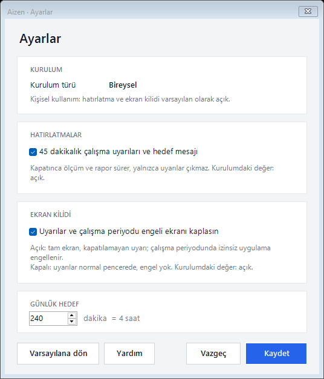
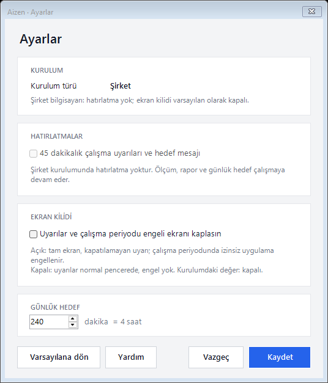

*Solda bireysel; sağda şirket: hatırlatma kutusu pasif.*

- **Kurulum türü:** Bireysel / Şirket / Özel; yalnızca gösterilir, kurulumda seçilir.
- **Hatırlatmalar:** 45 dakikalık çalışma uyarıları ve hedef mesajı. Kapatınca ölçüm ve rapor sürer. Şirket kurulumunda açılamaz.
- **Ekran kilidi:** açıkken uyarı tam ekran ve kapatılamaz, çalışma periyodunda izinsiz uygulama engellenir; kapalıyken uyarı normal pencerede çıkar, engel olmaz.
- Her kutunun altında **kurulumdaki değer** yazar.
- **Günlük hedef:** 15–720 dakika, saat karşılığıyla.
- **Varsayılana dön:** onay sorar; hatırlatma ve kilit seçimlerini silip kurulumdaki değerlere döner.
- **Yardım:** wiki'yi Ayarlar sayfasında açar. **Vazgeç** kaydetmeden kapatır.
- **Kaydet:** yalnızca değiştirdiğin ayarları yazar; ayar dosyasındaki diğer bilgiler (ör. yedek klasörü) korunur.

---

## 3. Yardım (uygulama içi wiki)

Kontrol panelindeki **Yardım** düğmesi açar. Sayfalar kurulum türüne göre süzülür.

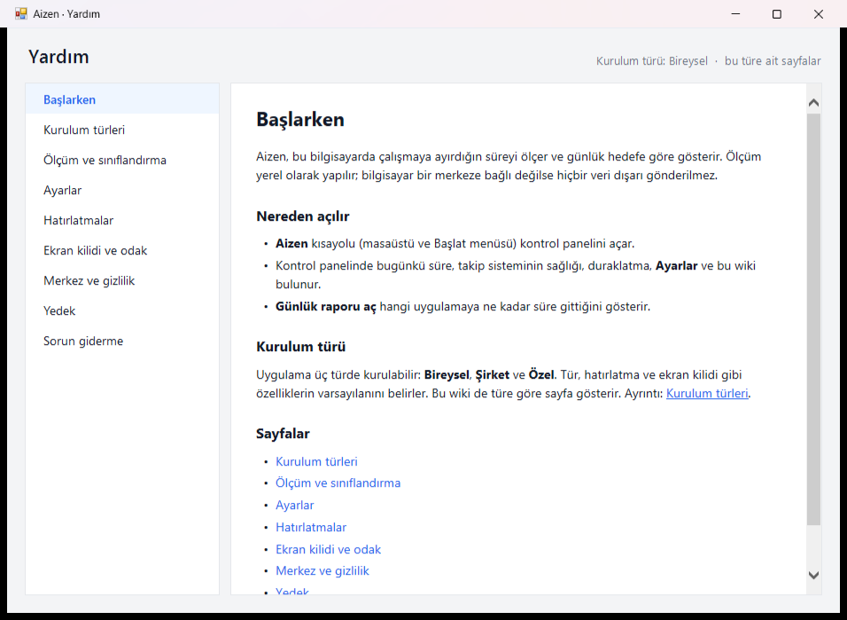

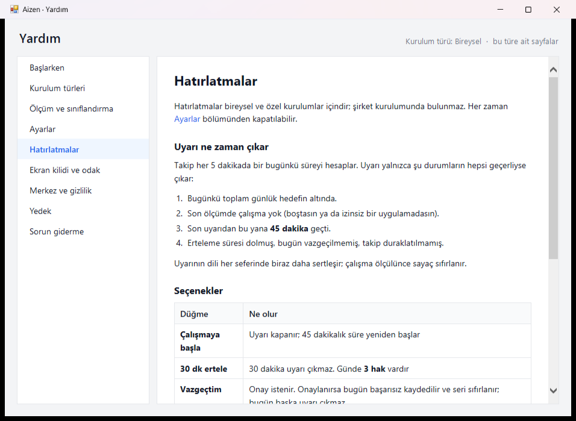
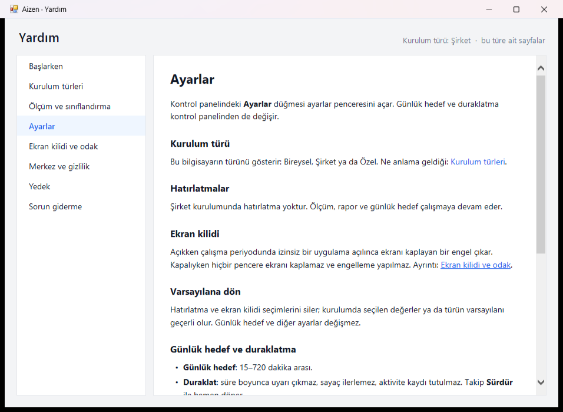

*Üstte ve solda bireysel kurulum; sağda şirket: Hatırlatmalar sayfası listede yok.*

- **Sol liste:** bu türe ait sayfalar. Bireysel ve özel kurulumda 9, şirkette 8 sayfa.
- **Sağ taraf:** seçili sayfa. Mavi bağlantılar başka bir wiki sayfasına geçer; internet adresi açılmaz.
- **Sağ üst:** bu bilgisayarın kurulum türü.
- Aynı sayfanın içinde türe özel bölümler de süzülür: şirket kurulumunda ertele/vazgeç anlatımı görünmez.

| Sayfa | Anlattığı |
|---|---|
| Başlarken | Uygulamanın ne yaptığı, nereden açıldığı, sayfa listesi |
| Kurulum türleri | Bireysel / Şirket / Özel farkı, türün merkezden bağımsız olduğu, türün nasıl değiştirildiği |
| Ölçüm ve sınıflandırma | 10 saniyelik ölçüm, boşta sayılma, izinli / izinsiz / belirsiz kararları, günlük hedef ve seri |
| Ayarlar | Her ayarın anlamı ve ayarların nerede saklandığı |
| Hatırlatmalar | Uyarının ne zaman çıktığı, ertele / vazgeç, kilide göre görünüm, hedef mesajı (şirkette yok) |
| Ekran kilidi ve odak | Çalışma periyodu, engel ekranı ve güvenlik sınırları |
| Merkez ve gizlilik | Eşleşme kodu, onay ekranı, merkeze ne gönderilip ne gönderilmediği |
| Yedek | Haftalık otomatik yedek ve geri yükleme |
| Sorun giderme | Süre artmıyor, uyarı / engel çıkmıyor, kayıt dosyaları |

Sayfaların kaynağı depodaki [`wiki/`](../wiki) klasörüdür.

---

## 4. Çalışma raporu

Kontrol panelindeki **Günlük raporu aç** düğmesi açar.

**Üst bölüm**
- **Gün seçimi:** geçmiş günlerin raporları.
- **Yeniden üret:** seçili günün raporunu ölçüm kayıtlarından yeniden oluşturur (tarayıcı geçmişi dahil).
- **Ham veri:** rapor klasörünü Dosya Gezgini'nde açar.
- **Özet:** çalışma / hedef, hedefin tutup tutmadığı, diğer, boşta ve toplam kayıt süresi, tarayıcı verisinin durumu.

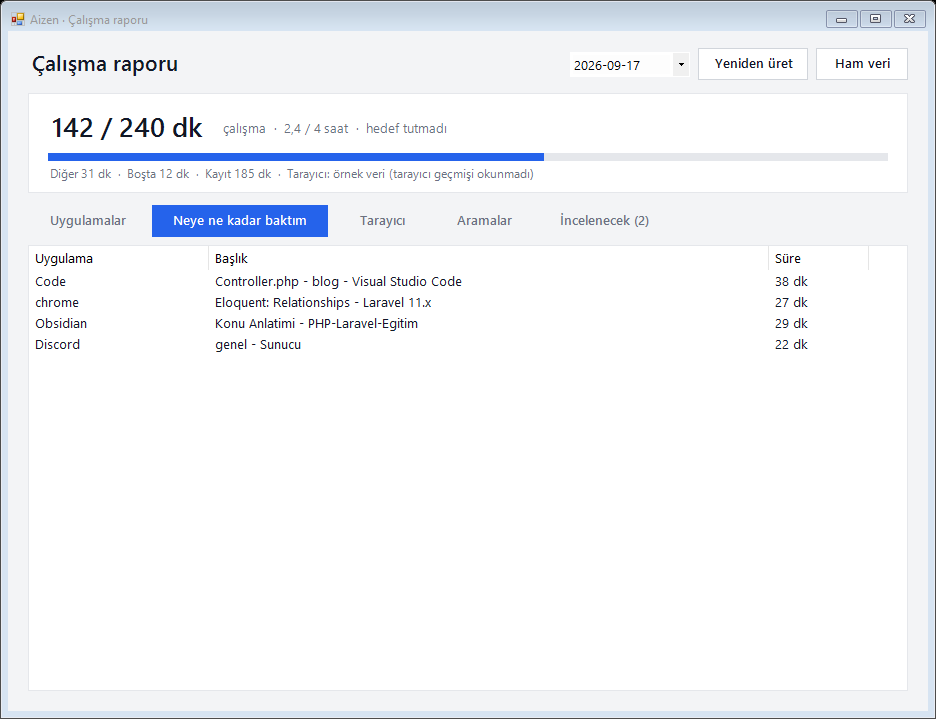
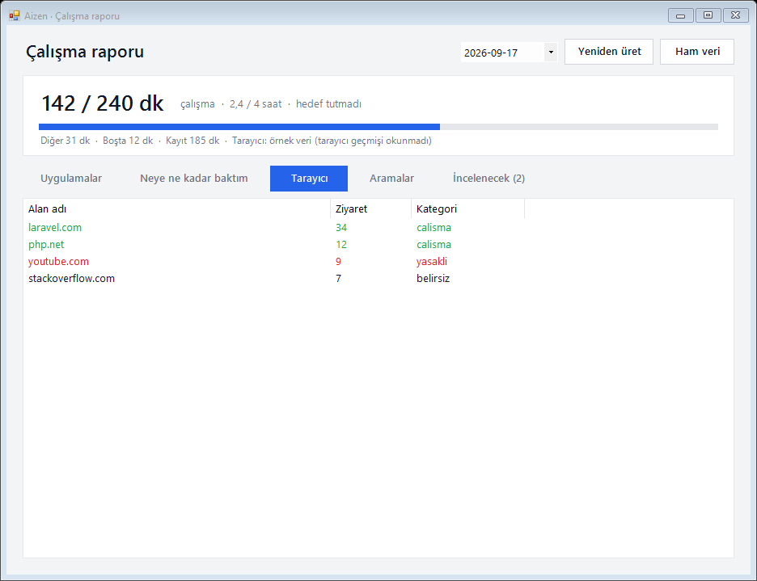

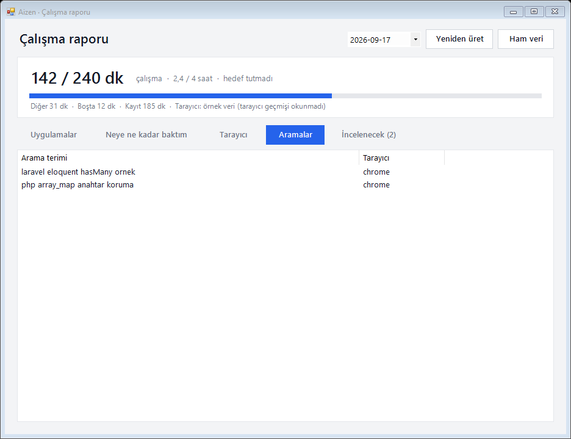
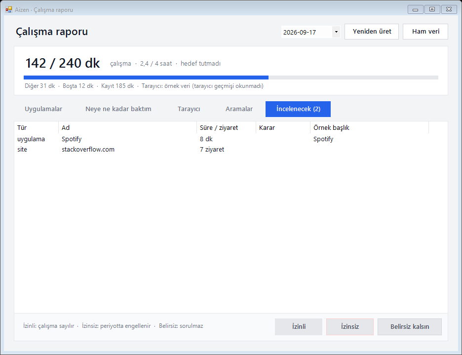

| Sekme | İşlevi |
|---|---|
| Uygulamalar | Uygulama başına süre, kategori, kararın kaynağı ve örnek pencere başlığı. Yeşil çalışma, kırmızı izinsiz, gri diğer/boşta. |
| Neye ne kadar baktım | Pencere başlığı bazında en çok vakit geçen içerikler. |
| Tarayıcı | Ziyaret edilen alan adları, ziyaret sayısı ve kategorisi. |
| Aramalar | Tarayıcıda yapılan arama terimleri (yalnızca bu bilgisayarda). |
| İncelenecek | Henüz karar verilmemiş uygulama ve siteler. Satır seçip **İzinli** (çalışma sayılır), **İzinsiz** (sayılmaz, periyotta engellenir) ya da **Belirsiz kalsın** (bir daha sorulmaz) seçilir; karar kurallara yazılır. Sekme adındaki sayı bekleyen öğe sayısıdır. |

---

## 5. Hatırlatma uyarısı

Yalnızca hatırlatmalar açıkken (bireysel ya da özel kurulum) çıkar: bugün hedefin
altındaysan, çalışma ölçülmüyorsa ve son uyarıdan 45 dakika geçtiyse.

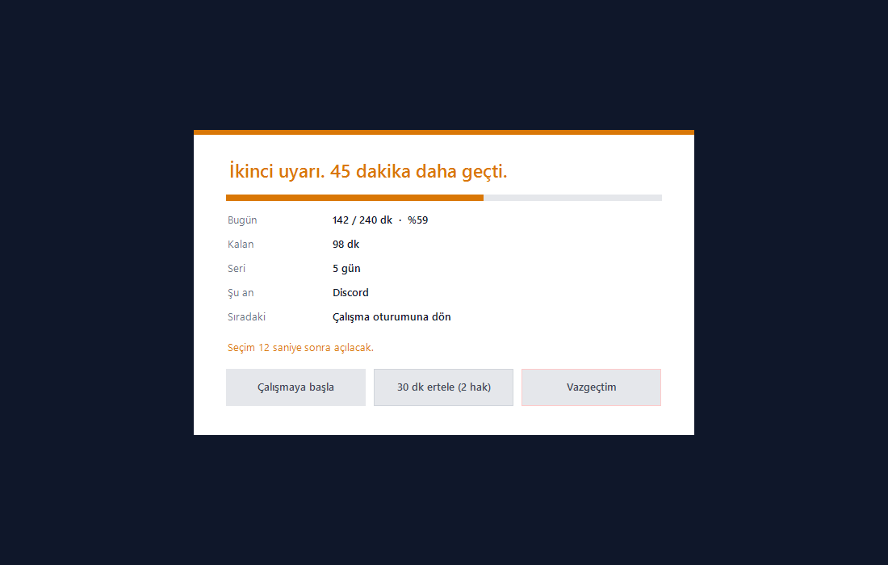
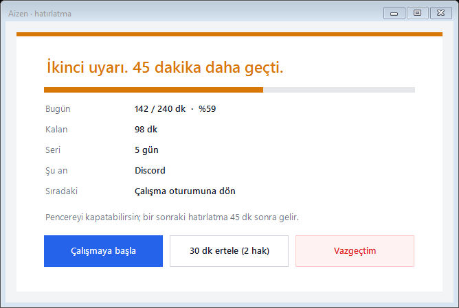

*Solda ekran kilidi açık (gerçekte bütün ekranları kaplar); sağda kilit kapalı: normal, kapatılabilir pencere.*

- **Satırlar:** bugünkü süre / hedef, kalan dakika, seri, öndeki uygulama.
- **Çalışmaya başla:** uyarıyı kapatır, 45 dakikalık süre yeniden başlar ve uygulama klasörünü açar.
- **30 dk ertele:** 30 dakika uyarı çıkmaz; günde 3 hak.
- **Vazgeçtim:** onay sorar; onaylanırsa gün başarısız kaydedilir, seri sıfırlanır ve o gün başka uyarı çıkmaz.
- **Kilit açıkken:** pencere taşınamaz, kapatılamaz, arkaya atılırsa öne döner; düğmeler 10–30 saniye sonra açılır. Seçim yapılmazsa 15 dakikada kapanır, 5 dakika sonra yeniden gelir.
- **Kilit kapalıyken:** düğmeler hemen açıktır. Pencere seçim yapmadan kapatılırsa bir sonraki uyarı 45 dakika sonra gelir.
- Uyarıların dili her seferinde biraz sertleşir; çalışma ölçülünce sayaç sıfırlanır.

---

## 6. Çalışma periyodu engeli

Yalnızca ekran kilidi açıkken ve bir çalışma periyodu sürerken, izinsiz bir uygulama öne
gelince yaklaşık 10 saniye içinde çıkar.

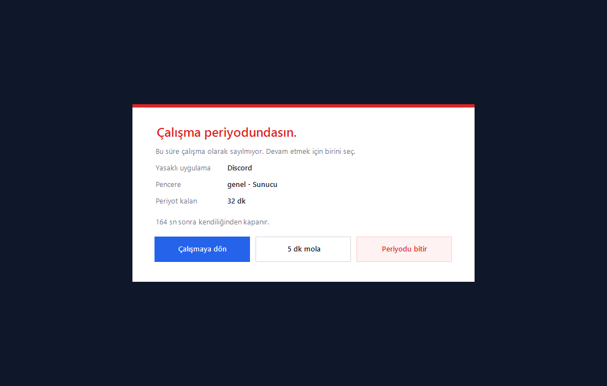

- **Satırlar:** izinsiz uygulama, pencere başlığı, periyodun kalan süresi.
- **Çalışmaya dön:** engeli kapatır.
- **5 dk mola:** periyot sürerken 5 dakika engel çıkmaz.
- **Periyodu bitir:** periyodu sonlandırır.
- **Güvenlik:** en geç 3 dakikada kendiliğinden kapanır, saatte en fazla 6 kez çıkar. Toplantı, kurulum ve sistem uygulamaları hiç engellenmez. ACİL DURDUR açıkken hiç çıkmaz.

---

## 7. Kurulum sihirbazı

`Aizen-Kurulum.exe` ya da ZIP içindeki `Kur.cmd` açar. Ayrıntı: [KURULUM.md](../KURULUM.md).

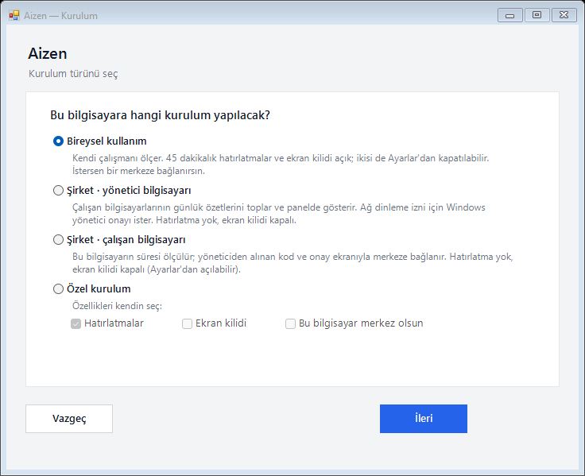
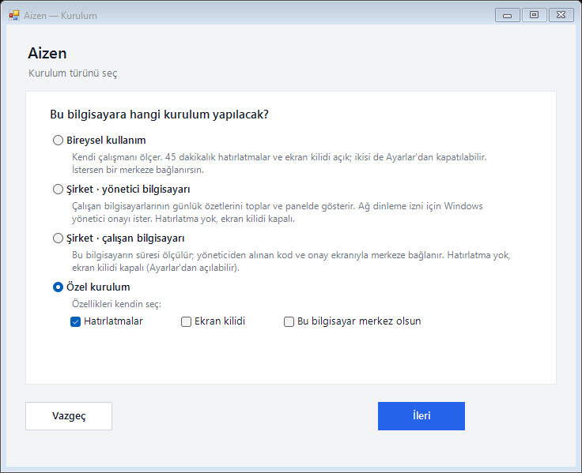

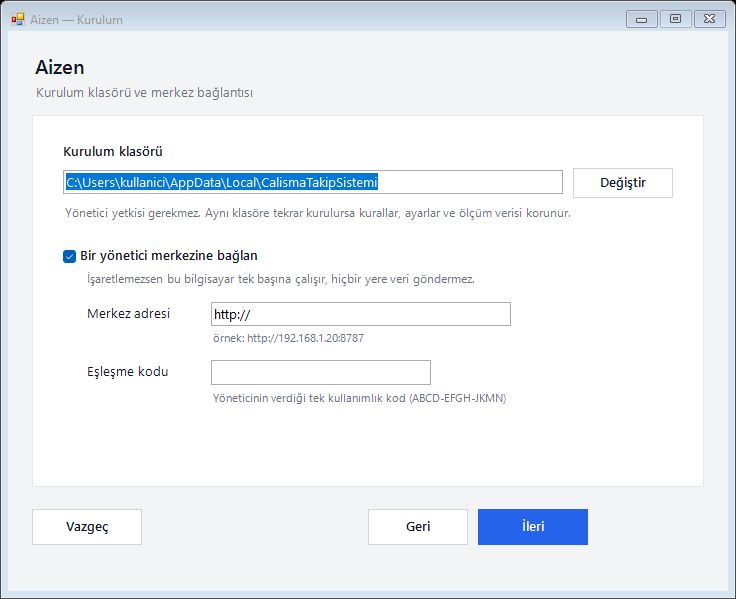
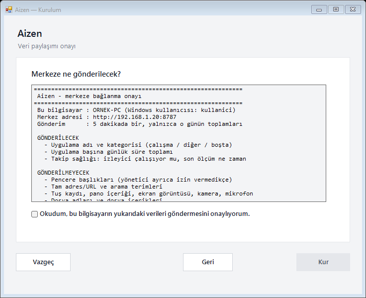

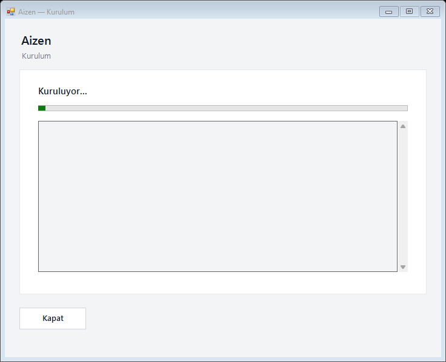

| Sayfa | İşlevi |
|---|---|
| 1 · Tür | **Bireysel** (hatırlatma ve kilit açık), **Şirket · yönetici** (çalışanların özetlerini toplayan merkez; Windows yönetici onayı ister), **Şirket · çalışan** (hatırlatma yok, kilit kapalı), **Özel** (hatırlatma, ekran kilidi ve "merkez olsun" kutuları açılır). Aynı bilgisayarda kurulum varsa türü seçili gelir. |
| 2 · Klasör | Kurulum klasörü (varsayılan kullanıcının LocalAppData klasörü; yönetici yetkisi gerekmez). Merkez olmayan kurulumda isteğe bağlı **merkeze bağlan**: merkez adresi ve yöneticinin verdiği tek kullanımlık eşleşme kodu. Bağlanılmayacaksa bu sayfada doğrudan **Kur** çıkar. |
| 3 · Onay | Merkeze ne gönderilip ne gönderilmeyeceği. Onay kutusu işaretlenmeden **Kur** pasiftir; onay yoksa bağlantı kurulmaz. |
| 4 · Kurulum | Kurulumun canlı çıktısı; bitince "Kurulum tamamlandı" ya da hata kodu ve **Bitir**. Aynı klasöre yeniden kurulum güncelleme yapar; kurallar, ayarlar ve ölçümler korunur. |

---

## 8. Merkez paneli

Yalnızca merkez (yönetici) bilgisayarında, masaüstündeki **Aizen Merkez** kısayoluyla
açılır. 20 saniyede bir yenilenir.

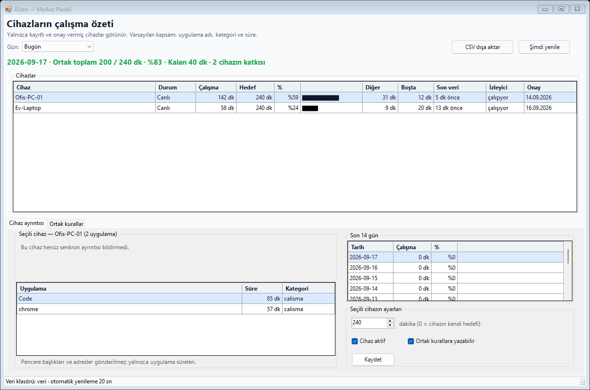

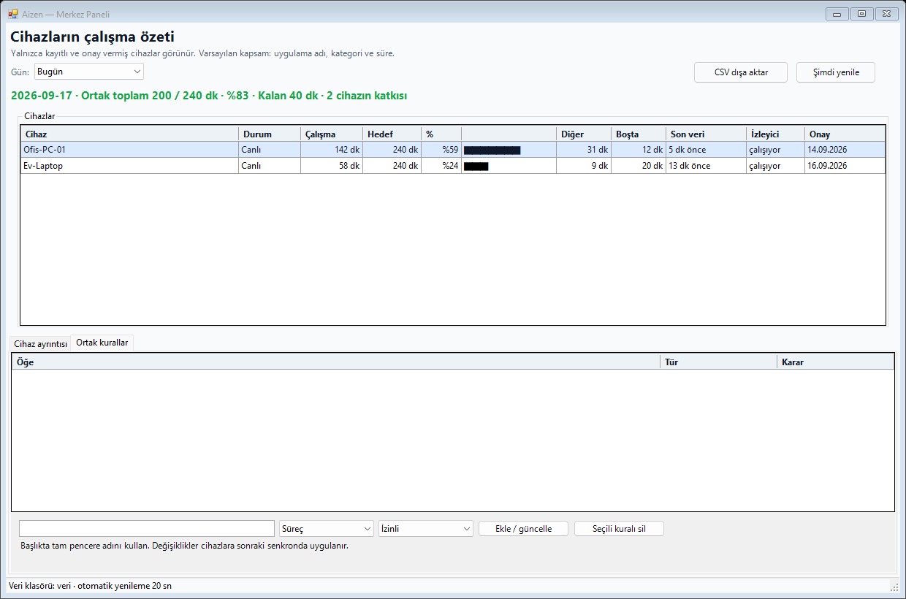

- **Üst:** gün seçimi, **CSV dışa aktar**, **Şimdi yenile**; ortak toplam, ortak hedef, yüzde, kalan dakika ve katkı veren cihaz sayısı.
- **Cihazlar tablosu:** durum (canlı / sessiz / veri yok), çalışma, hedef, yüzde çubuğu, diğer, boşta, son veri zamanı, izleyici durumu, onay tarihi.
- **Cihaz ayrıntısı:** senkron durumu, uygulama başına süre (pencere başlığı ve adres gelmez), son 14 gün.
- **Seçili cihazın ayarları:** cihaz hedefi, cihaz aktif mi, ortak kurallara yazabilir mi; **Kaydet**.
- **Ortak kurallar:** öğe, tür (süreç / başlık / alan adı) ve karar (izinli / izinsiz / belirsiz) ile **Ekle / güncelle**, **Seçili kuralı sil**. Cihazlara sonraki senkronda (5 dk) gider.

---

## 9. Görüntüsü olmayanlar

- **Kısa mesaj kutuları:** "Hedef tamamlandı" (hedef tutunca bir kez, yalnızca hatırlatmalar açıkken), "Emin misin?" (Vazgeçtim onayı), duraklatma / periyot / acil durdurma bilgi mesajları.
- **Yedekten geri yükle** (Başlat menüsü): yedek ZIP'ini seçtirir, doğrular, onay sorar, önce mevcut verinin güvenlik yedeğini alıp sonra geri yükler.
- **Kaldır** (Başlat menüsü ya da Windows Uygulamalar): konsolda onay sorar; görevleri, kısayolları ve Uygulamalar kaydını kaldırır; ölçüm verisi yerinde kalır.
- **Mac uygulaması:** menü çubuğunda süre, *Aizen'i aç*, duraklat ve acil durdur. Panel sekmeleri: *Takip ve rapor* (günlük dağılım, 45 dk odak, incelenecek uygulamalar), *Yerel kurallar*, *Merkeze bağlan*, *Mac merkez*, *Ayarlar ve yedek* (kurulum türü, hatırlatma, ekran kilidi, hedef, yedek) ve *Yardım* (aynı wiki). Mac kodu henüz derlenmedi; görüntü ancak bir Mac'te alınabilir.
