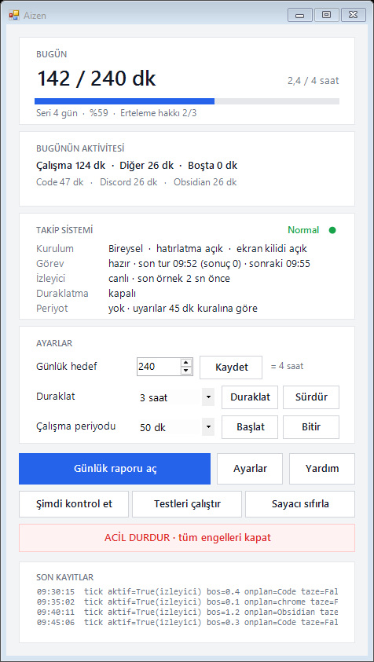
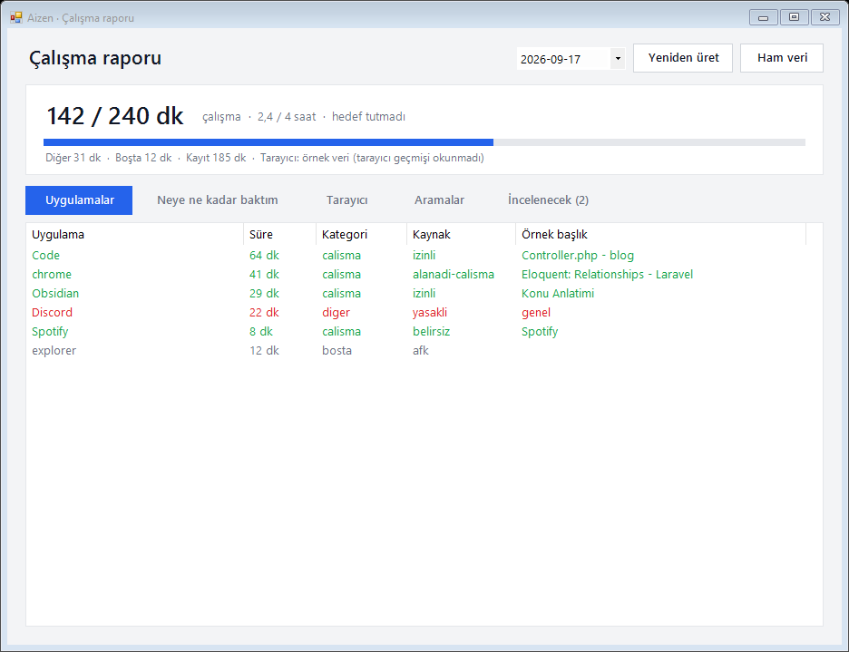

# Aizen

Çalışma Takip Sistemi'nin yeni adı. Görünen her yerde (pencereler, kısayollar, Windows Uygulamalar listesi, kurulum, Mac menüsü) Aizen yazar; zamanlanmış görev adları (`Calisma Takip Sistemi`, `Calisma Takip Yedek` …), kurulum ve veri klasörleri, Mac paket kimliği ve merkez protokolü mevcut kurulumlar bozulmasın diye eski teknik adlarını korur.

**Kurulum:** [KURULUM.md](KURULUM.md) · **Ekranlar ve işlevleri:** [Aizen-Ekranlar](Aizen-Ekranlar/README.md)

 

Herhangi bir müfredat veya projeden bağımsız, yerel çalışan bir çalışma takip sistemi. Ön plan uygulamasını ve etkinliği ölçer, günlük hedefi takip eder, uyarı gösterir ve rapor üretir.

Tek proje, iki platform. İki sürüm aynı merkez protokolünü konuşur: bir Windows ile bir Mac aynı merkeze bağlanıp ortak kuralları ve ortak sayacı paylaşabilir, merkez de ikisinden birinde çalışabilir.

| Platform | Klasör | Teknoloji | Kurulum |
|---|---|---|---|
| Windows 10/11 | `hatirlatici/`, `dagitik/` | Windows PowerShell 5.1, WinForms | `Aizen-Kurulum.exe` ya da ZIP ([kılavuz](dagitik/README.md)) |
| macOS 13+ | `macos/` | Swift, SwiftUI | `macos/Kur.command` ([kılavuz](macos/README.md)) |

İki platformun uyması gereken sözleşme `uyumluluk/` klasöründedir: protokol belgesi ve iki tarafın da doğruladığı test vektörleri.

Windows'ta başlatmak için `Aizen.lnk` kısayolunu kullan. Sistem ilk açılışta Görev Zamanlayıcı kaydını ve arka plan izleyicisini hazırlar.

## Kurulum türleri

| Tür | Hatırlatmalar (45 dk uyarısı, hedef mesajı) | Ekran kilidi (tam ekran uyarı, periyot/odak engeli) |
|---|---|---|
| Bireysel | Açık, Ayarlar'dan kapatılabilir | Açık, Ayarlar'dan kapatılabilir |
| Şirket | Yok | Kapalı, Ayarlar'dan açılabilir |
| Özel | Kurulumda seçilir | Kurulumda seçilir |

Ölçüm, rapor ve günlük hedef her türde aynıdır. Tür merkez rolünden bağımsızdır. Uygulamanın
içinde türe göre sayfa gösteren bir yardım (wiki) vardır; sayfalar `wiki/` klasöründedir.

## Klasör yapısı

- `hatirlatici/`: Windows uygulama kodu, ayarlar ve yerel veriler
- `hatirlatici/aktivite/`: 10 saniyelik ham etkinlik örnekleri
- `hatirlatici/rapor/`: günlük özetler
- `dagitik/`: Windows çok cihaz katmanı (merkez sunucu, istemci, panel) ve kurulum paketi
- `macos/`: Mac uygulaması (menü çubuğu, yerel takip, merkez istemcisi ve merkez sunucusu)
- `uyumluluk/`: platformlar arası protokol sözleşmesi ve test vektörleri
- `wiki/`: uygulama içi yardım sayfaları (Windows ve Mac ortak; biçim `wiki/README.md`)
- `araclar/`: geliştirme araçları
- `Calisma Kaydi.md` ve `Aktivite Gunlugu.md`: otomatik oluşturulan okunabilir görünümler (Windows)

## AI bağlantısı

Yerel takip MCP sunucusu `hatirlatici/mcp.ps1`'dir; istemci bağlantı örneği dosyanın başındadır (bu makinede `.mcp.json` tanımlar). Araçlar güncel durum, günlük rapor, günlük özet ve açıkça onaylanan sınıflandırma kararlarını sağlar.

Kurallar `hatirlatici/kurallar.json` içindedir. Bir uygulama veya alan adını yalnızca kullanıcı kararıyla çalışma, yasaklı ya da belirsiz olarak sınıflandır.

## Gizlilik

Tüm veriler bu bilgisayarda bu klasörde tutulur. Etkinlik kayıtları pencere başlıklarını, günlük rapor ise isteğe bağlı olarak tarayıcı geçmişi ve arama terimlerini içerebilir. Klasörü bulutla eşitlemeden veya paylaşmadan önce bunu dikkate al.

## Dağıtık merkez (isteğe bağlı)

`dagitik/` klasörü, bir yönetici bilgisayarının izin vermiş cihazların günlük
çalışma özetlerini toplamasını ve tek ekranda karşılaştırmasını sağlar. Dağıtım
için tek dosya kurulum üretilir (`Aizen-Kurulum.exe`): çalıştırılınca
sihirbaz açılır ve kurulum türünü (bireysel, şirket · yönetici, şirket · çalışan, özel) orada seçersin.

Bağlantı yalnızca izinle kurulur: yönetici cihaz başına tek kullanımlık bir
eşleşme kodu üretir, kullanıcı kodu girer ve ne gönderilip ne gönderilmeyeceğini
listeleyen onay ekranını kabul eder. Onay yoksa bağlantı kurulmaz, sistem tek
başına çalışır. Varsayılan aktarım yalnızca uygulama, kategori ve süre özetidir;
pencere başlığı, tam URL, arama, tuş kaydı ve ekran görüntüsü gönderilmez.

Bilgisayarlar farklı ağlarda olabilir: aktarım şifreli zarfla yapılır (eşleşme kodu
ağa hiç çıkmaz), merkez port yönlendirmeyle internete açılabilir ya da port
açılamıyorsa kiralık bir Linux sunucudaki **posta kutusu** kullanılır
([posta-sunucusu/](posta-sunucusu/README.md)). Posta kutusu zarfları taşır,
içeriklerini okuyamaz; merkez kapalıyken özetler orada bekler.

Kurulum, panel, kaldırma, ağ sınırı ve güvenlik için
[dağıtık sistem kılavuzuna](dagitik/README.md) bak.

## Geliştirme

Claude Code ile Codex sırayla geliştirir. Ajan kuralları ve teknik tuzaklar
`AGENTS.md`'de, kimin ne bıraktığı `DEVIR.md`'de (yerel depoda).

Testler (Windows PowerShell 5.1):

- `dagitik\test-dagitik.ps1`: kendi geçici klasörlerinde çalışır; temiz bir kopyada da koşar.
- `hatirlatici\test-ozellikler.ps1`: kurulum türü, ayar yazımı ve wiki; geçici klasörlerde, pencere açmadan.
- `hatirlatici\test.ps1`, `test-api.ps1`, `test-kapsamli.ps1`: çalışan bir kuruluma bakar
  (Görev Zamanlayıcı görevi, `durum.json` gibi çalışma zamanı dosyaları); kurulu sistemde anlamlıdır.
- `hatirlatici\test-izole.ps1`, `test-arkaplan.ps1`: pencere açar, odak çalar.

Mac (Swift): `macos` klasöründe `swift test`. Windows'ta derlenemez; doğrulama GitHub Actions ve gerçek Mac ile yapılır.

GitHub Actions (`.github/workflows/`):

- `windows.yml`: `test-dagitik.ps1`, bir kez makinenin kültüründe, bir kez Türkçe (tr-TR) kültürde; `test-ozellikler.ps1` tr-TR'de.
- `macos.yml`: Mac uygulamasını derler, Swift testlerini ve Windows uyumluluk testlerini çalıştırır, uygulama paketini üretir.

`araclar\github-disa-aktar.ps1` paylaşım için kişisel dosyaları çıkarılmış bir anlık görüntü üretir.

İki istemciyi tek bir kod tabanına indirme seçenekleri ve planı: [TEK-UYGULAMA-RAPORU.md](TEK-UYGULAMA-RAPORU.md).
